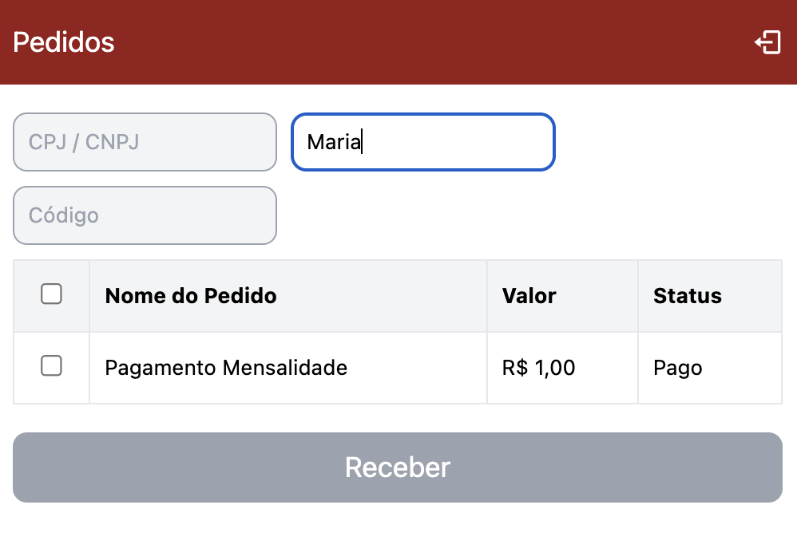

# Projeto de Pedidos

Este é um projeto de pedidos desenvolvido em React.js com integração com uma API para obter e filtrar pedidos. O projeto inclui funcionalidades como login, filtragem de pedidos e navegação para a página de pagamento.

## Requisitos

- Node.js (versão 14 ou superior)
- npm ou yarn

## Instalação

1. Clone o repositório para o seu ambiente local:
   ```bash
   git clone https://github.com/seu-usuario/seu-repositorio.git
Navegue até o diretório do projeto:


```
cd seu-repositorio
````
2. Instale as dependências do projeto:

```
npm install
```
ou
```
yarn install
````

3. Rodando o Projeto
Para rodar o projeto localmente, execute o seguinte comando:

```
npm run dev
```
ou

```
yarn dev
````

O projeto estará disponível em http://localhost:5173.

## Rodando os Testes
Para executar os testes unitários, use o comando:

```
npm test
```
ou
```
yarn test
```

## Estrutura do Projeto
* src/: Contém todo o código fonte do projeto.
    - pages/: Páginas principais do aplicativo.
        * Login.jsx: Página de login.
        * Orders.jsx: Página de pedidos.
        * Payment.jsx: Página de pagamento.
    - shared/: Componentes e utilitários compartilhados.
        * components/: Componentes reutilizáveis.
            * ProtectesRoute.jsx: Componente de rota protegida.
        * ui/: Componentes de interface de usuário.
            * Button.jsx: Componente de botão.
            * Form.jsx: Componente de formulário.
            * FormItem.jsx: Componente de item de formulário.
            * InputText.jsx: Componente de input de texto.
            * Notification.jsx: Componente de notificação.
            * Select.jsx: Componente de seleção.
            * Table.jsx: Componente de tabela.
        - utils.js: Funções utilitárias.
        - validations.js: Funções de validação.
    - services/: Serviços de API.
        * api.js: Configuração e chamadas de API.

## Configurações de Ambiente
* vite.config.js: Configurações do Vite para o desenvolvimento do projeto.
* postcss.config.js: Configurações do PostCSS.
* tailwind.config.js: Configurações do Tailwind CSS.

## Funcionalidades
* Login: O usuário pode fazer login usando suas credenciais.
* Pedidos: O usuário pode visualizar, filtrar e selecionar pedidos.
* Pagamento: O usuário pode navegar para a página de pagamento após selecionar os pedidos.

## Screenshots
Adicione screenshots do projeto para ilustrar suas funcionalidades. Coloque os arquivos de imagem na pasta screenshots e referencie-os aqui.

### Login Page


### Orders Page





### Payment Page


